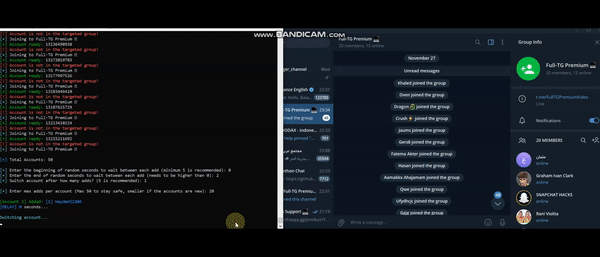

🚀 A comprehensive Telegram marketing automation suite featuring 43+ tools, including Member Adder, Scraper, Mass DM, Forwarder, and API ID Creator.

# GET HERE: https://shorturl.at/TI7Vt
## For any questions: https://shorturl.at/pfRnW

### TelegramTool #TelegramMarketing #TelegramBot #Automation

## ✨ Nearly 50 Capabilities

### 👥 Member Administration
- **Telegram Member Adder** - Include users into groups/channels

- **Active Member Scanner** - Detect the most active participants
- **Telegram Scraper** - Pull members from groups/channels (+200k)
- **User Extractor** - Export user databases (+200k)
- **Member Filter** - Sort users by activity, date, premium status, etc.

- **Clone/Copy Targets** - Duplicate any target in real-time.

### ❌ Removal of Competition
- **Automatic Re ports** - Eliminate any targets (users, groups, channels) automatically using specific reasons.

### 📢 Bulk Messaging

- **Mass DM Sender** - Bulk direct messaging
- **Message Forwarder** - Share messages across groups
- **Forward Old Messages** - Archive and relay historical messages
- **Forward Messages Realtime** - Instant message transfer between chats
- **Realtime Message Scraper** - Capture all incoming new messages
- **Complete Message Scraper** - Scrape all old messages from groups/channels
- **Auto Reply** - Automated response system
- **Scheduled Messaging** - Time-based message delivery
- **Automatic Polls** - Generate and manage polls automatically
- **Message Templates** - Create and reuse message templates
- **Multi-Language Support** - Send messages in various languages
- **Media Attachment** - Support for files, images, and videos
- **HTML Formatting** - Rich text message capabilities

### 🚀 Engagement Enhancement
- **Increase Views** - Boost post visibility and view counts

- **Reactions Bot** - Automatic emoji reactions to posts
- **View Booster** - Improve content visibility
- **Group/Channel Finder** - Discover links for groups/channels using your keywords.
- **Hashtag Optimizer** - Automatic hashtag research

### 🔐 Account Handling
- **API ID Creator** - Generate Telegram API credentials
- **Session Manager** - Manage multiple accounts

- **Proxy Supported** - Full proxy integration (HTTP/SOCKS)
- **Auto-Joiner** - Join any target automatically with every account.

- **Auto-Leaver** - Leave any target automatically with every account
- **Ban-Checker** - Verify if accounts are banned and clean your list.
- **Spam-Checker** - Check if your accounts are ready to go.
- **Frozen-Checker** - Check if your accounts are ready to go. (New from TG)
- **Unspam Accounts** - Remove any limits.
- **Unfreeze Accounts** - Remove the Frozen status of your accounts.

### AND MUCH MORE!

# GET HERE: https://shorturl.at/TI7Vt
## For any questions: https://shorturl.at/pfRnW
